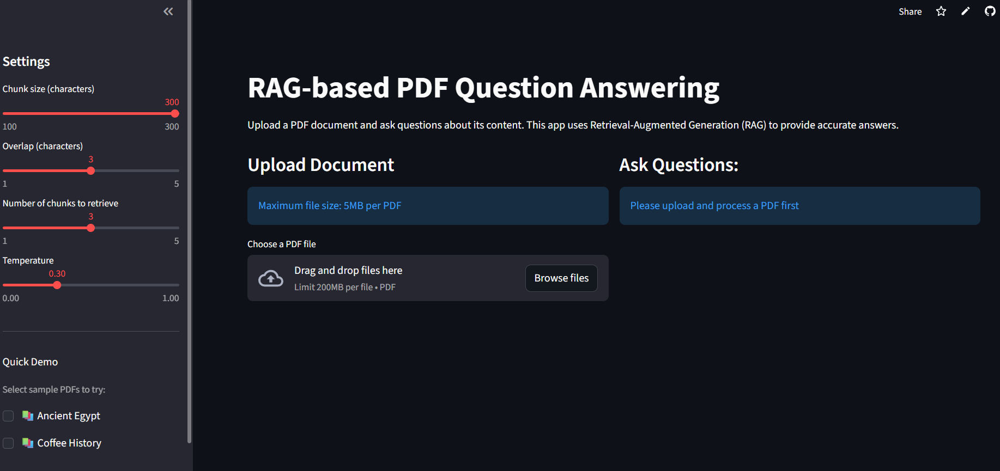
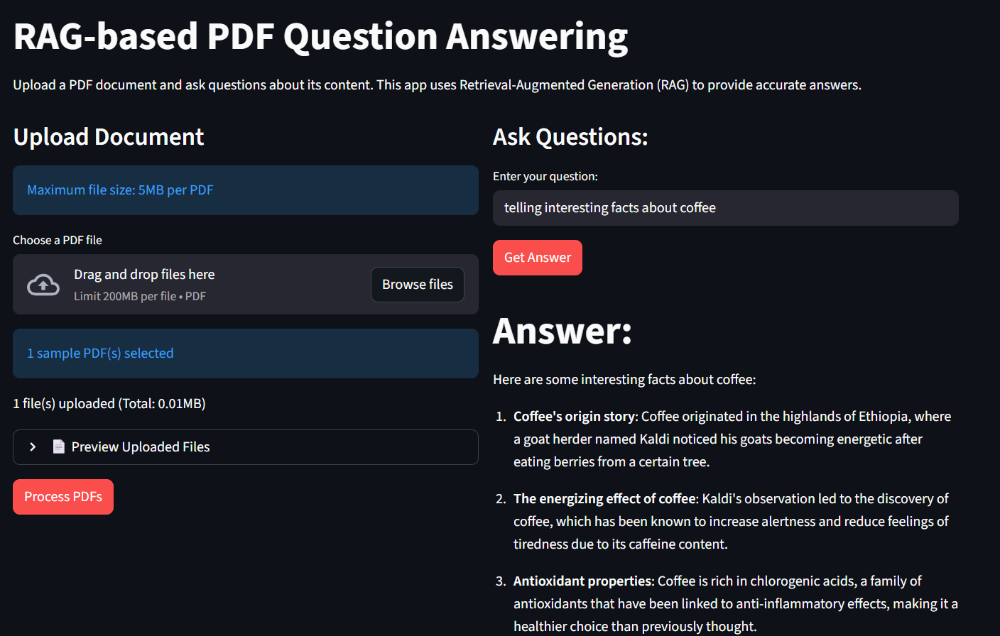

# RAG-Based PDF Question Answering System

A PDF Q&A app that uses Retrieval-Augmented Generation to answer questions about your documents. Built with Python, Streamlit, and Groq's Llama 3.1.

🔗 **[Try it live](https://rag-pdfapp.streamlit.app/)**

## What it does

Upload a PDF, ask questions about it, and get AI-generated answers based on the actual content. The app uses vector embeddings and similarity search to find relevant sections before generating responses.

You can try it with the built-in sample PDFs or upload your own.

## Features

- Upload multiple PDFs at once
- Live PDF preview in the browser
- Adjustable RAG parameters (chunk size, retrieval count, temperature)
- Vector similarity search using FAISS
- Powered by Groq's Llama 3.1 8B model
- Demo mode with sample documents
- Rate limiting and file size controls

## Tech Stack

- **Python** for backend logic
- **Streamlit** for the web interface
- **FAISS** for vector similarity search
- **Sentence Transformers** (all-MiniLM-L6-v2) for embeddings
- **Groq API** for LLM inference
- **PyPDF** for text extraction

## How to run locally
```bash
git clone https://github.com/Tusharvimal/RAG-PDF_QA.git
cd RAG-PDF_QA

pip install -r requirements.txt

# Create a .env file and add your Groq API key
echo "GROQ_API_KEY=your_key_here" > .env

streamlit run app.py
```

## How it works
```
PDF → Extract text → Split into chunks → Generate embeddings → Store in FAISS
                                                                      ↓
Question → Generate embedding → Find similar chunks → Send to LLM → Get answer
```

## Screenshots

### Main Interface


### Example Output


## Author

**Tushar Vimal**  
[GitHub](https://github.com/Tusharvimal) | [LinkedIn](https://www.linkedin.com/in/tusharvimal/)

---

⭐ Star this repo if you find it useful!